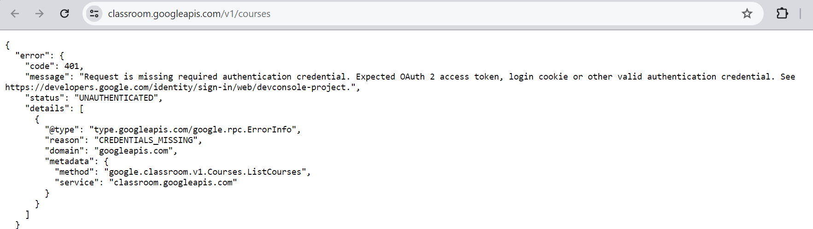
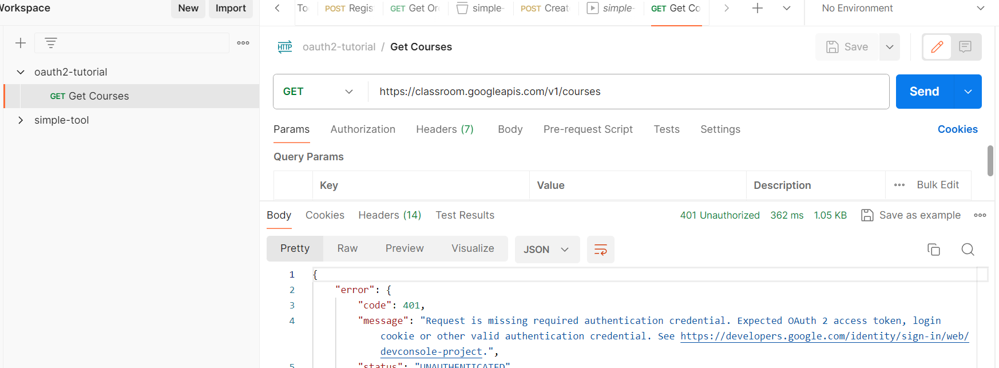
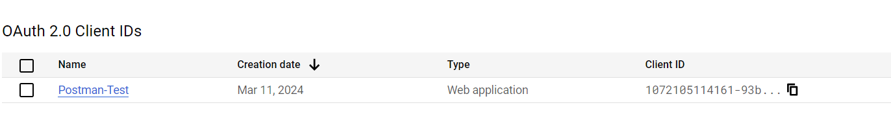
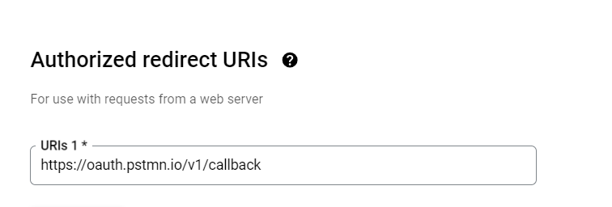
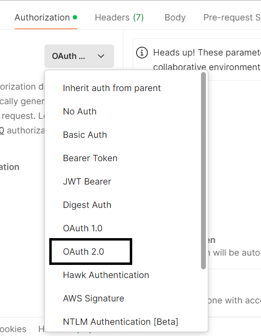
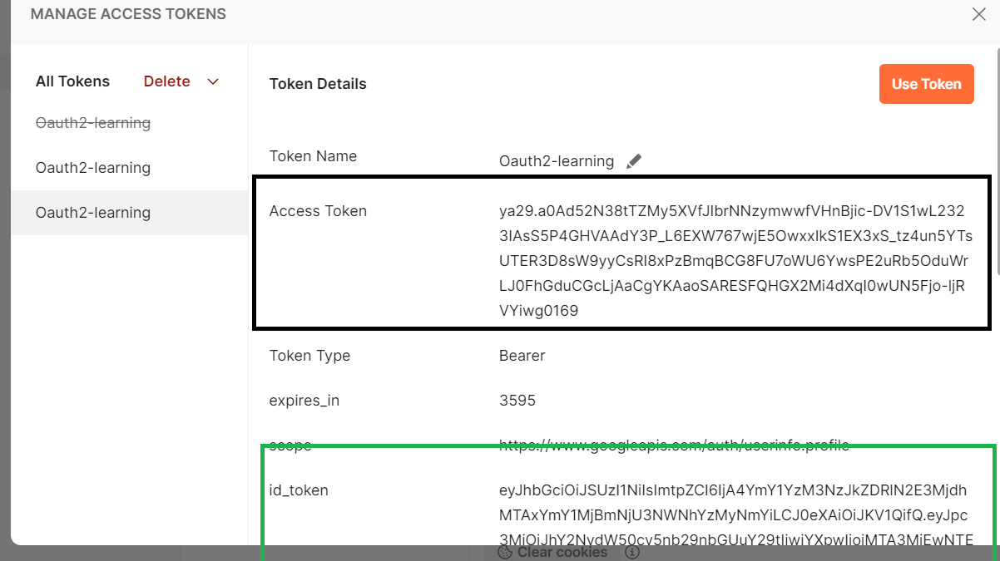
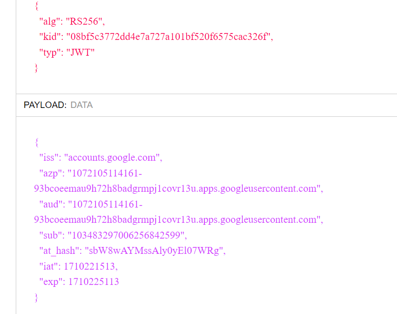

# Goal understand __Authorization Code Flow__ with Google OAuth2

We will use [this tutorial](https://hmh.engineering/how-to-get-oauth-access-token-and-retrieve-data-from-google-apis-using-postman-9a95ffe030ae) which explains with basic HTTP requests using Postman.

___

## Steps

<details>
  <summary>prerequisites</summary>

* Postman tool and basics of Postman
* OAuth2 Concepts ( [oauth2 simplified](https://aaronparecki.com/oauth-2-simplified/) ) 

</details>

___

<details>
  <summary>google courses API through browser</summary>

* Browse this URL https://classroom.googleapis.com/v1/courses using.
  * You will get __401__ error suggesting that we need authorization to get the information
  * This is where we will use Postman to redirect the user to login(and hence authorization to view the courses)
  

</details>

___

<details>
    <summary>Initial testing through PostMan</summary>

* create new request
* get
  * https://aaronparecki.com/oauth-2-simplified/
* save to new collection "oauth2-tutorial"
  

</details>

___

<details>
  <summary>app registration in google</summary>

In order to use google as OAuth2 Provider(where users can login to google and hence goole authenticates the user)

* login to [console google](console.cloud.google.com)
* API & Access
* Create new project
* Create new credential
  * 
  * Note down clientid and client secret
  * Add https://oauth.pstmn.io/v1/callback as redirect URI
    * 
</details>

___

<details>
    <summary>getting access token in postman</summary>

* in Authorization select OAuth 2.0
  * 
  * fill the auth url as 
    ```cmd
        https://accounts.google.com/o/oauth2/auth
    ``` 
  * fill the access token url as
   ```cmd
        https://accounts.google.com/o/oauth2/token
   ```
  * fill client id and client secret.
  * callback url (redirect URI) as
    ```cmd
        https://oauth.pstmn.io/v1/callback
    ```
  * scope as _profile_
* Click _Get New Access Token_ button
  * You will be shown gmail login page
  * Once logged in successfully , the postman will show the access token details as below
        * 

  * Access token is something we cannot decode as it is not for the application to know
  * Id token is standard _jwt_ token which you can copy at http://jwt.io and decode
    * 
</details>
