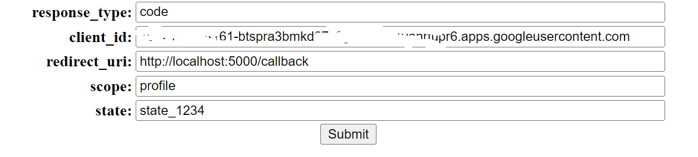
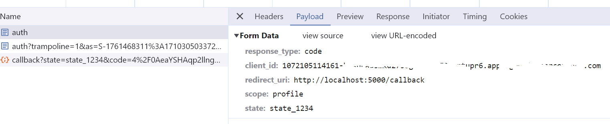
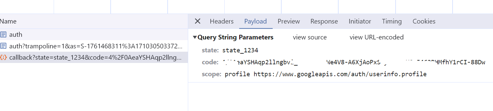
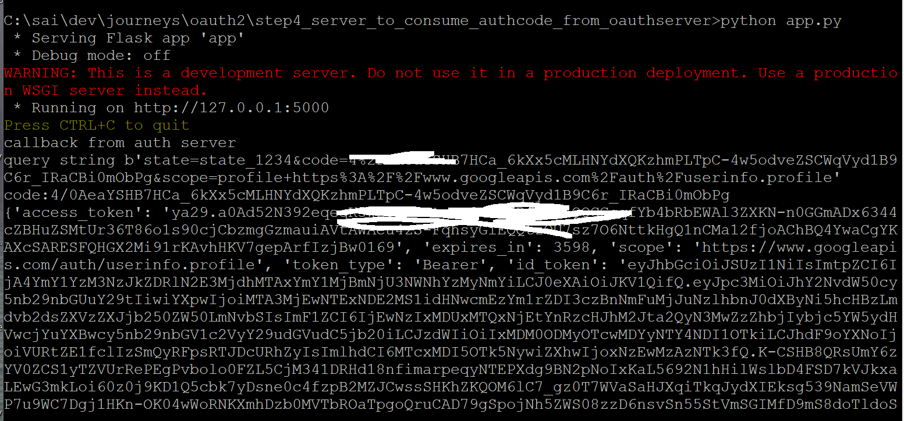

# Goal
We will build a simple Python server to consume the authorization code from an OAuth2 server and obtain an access token.

## Steps

In the OAuth authorization flow, the user will be redirected to the web server from their browser with an authorization code. The server can then exchange this code to obtain an access token.

<details>
  <summary>initial api server using flask</summary>

* install flask
  ```cmd
    pip install Flask
  ```
* app.py
```python
# https://www.moesif.com/blog/technical/api-development/Building-RESTful-API-with-Flask/
import json
from flask import Flask, jsonify, request

app = Flask(__name__)


employees = [ { 'id': 1, 'name': 'Ashley' }, { 'id': 2, 'name': 'Kate' }, { 'id': 3, 'name': 'Joe' }]

@app.route('/employees', methods=['GET'])
def get_employees():
 return jsonify(employees)

if __name__ == '__main__':
   app.run(port=5000)  
```

* run the server
  ```cmd
    python app.py
  ```
* test it
  ```cmd
    http://127.0.0.1:5000/employees 
  ```
</details>

___

<details>
    <summary>adding /code to consume authorization code</summary>

```python
@app.route('/callback', methods=['GET'])
def on_callback_from_authserver():
    print("callback from auth server")
    print(f"query string {request.query_string}")
    code = request.args.get('code')
    print(f"code:{code}")

    # POST https://api.authorization-server.com/token
    #   grant_type=authorization_code&
    #   code=AUTH_CODE_HERE&
    #   redirect_uri=REDIRECT_URI&
    #   client_id=CLIENT_ID&
    #   client_secret=CLIENT_SECRET

    access_token_url = 'https://accounts.google.com/o/oauth2/token'
    data = {
    'grant_type': 'authorization_code',
    'code' : code,
    'client_id' : '<clientidhere>',
    'client_secret' : '<client-secret-here>',
    'redirect_uri' : "http://localhost:5000/callback"
    }
    
    response = requests.post(access_token_url,data)
    print(response.json())
    return response.json(),200

```

</details>

____

<details>
  <summary>add localhost uri in redirects</summary>


</details>

___

<details>
  <summary>login page</summary>

see the login.html which has parameters to submit below request

```txt
https://authorization-server.com/auth?response_type=code&
  client_id=CLIENT_ID&redirect_uri=REDIRECT_URI&scope=photos&state=1234zyx
```


</details>

___

<details>
 <summary>getting access token</summary>






</details>

___
