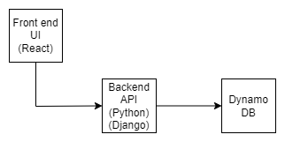

    
Goal

  
    Design initial release version of shopping cart.

    
 Initial design 

    
 Strategy 

* Start with UI in _React_ app
* Do step by step
* Learn along the way and document
* Introduce Backend using _Django_ framework
* Add local _DynamoDb_ along the way

