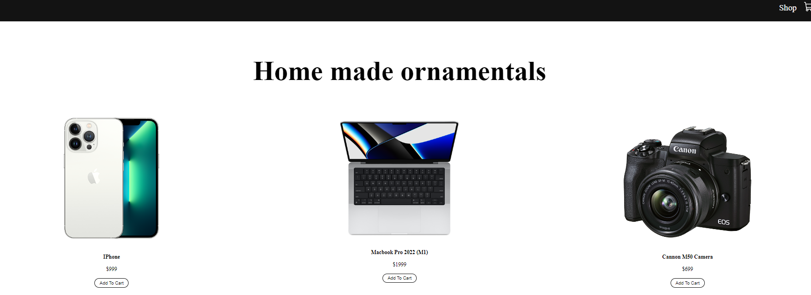

# Goal
    Display the products page
____
## Details
* Added Shop, Cart ,Product pages
* Added static products.js file for static products
* Added assets for images
____

## UI

___

## Learning
* Adding .css at parent page is enough as it will be inherited in child pages.
____

## Resource
[React Shopping Cart Ecommerce Beginner Website](https://www.youtube.com/watch?v=tEMrD9t85v4)
