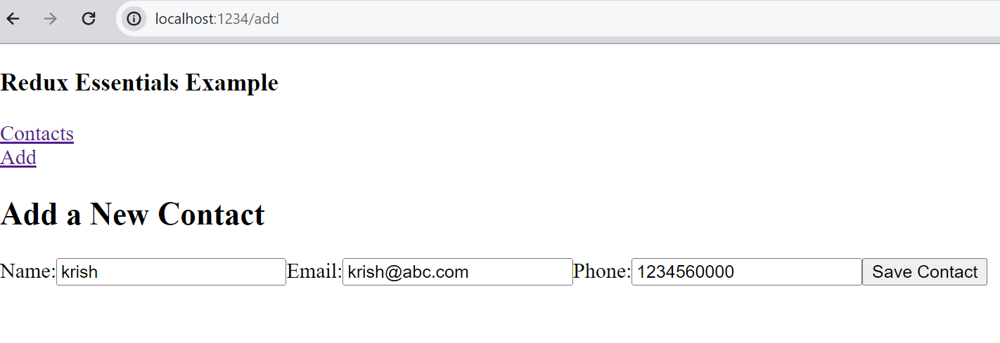
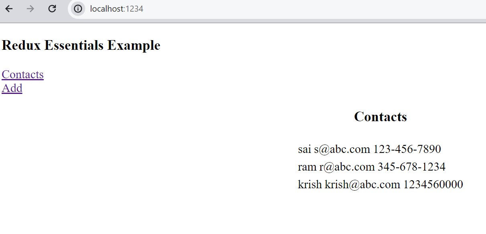

# Goal
Document high level of our understanding of Redux concepts in our own way

## Details

* we will start from previous step where we have just displayed contacts
* we will add contact and in the process see how we understand _redux_ concepts related to update the _store_

<details>
  <summary>action objects</summary>

* When you updating the parts of _state_ what we need is __what part__ to update with __what data__.
  * __what part__
    * type (will identify in big state object)
    * ex: contact
  * __what data__
    * payload
  * we can kind of think a _message_ with _data_ in messaging system.
* __action objects__
  * will have _type_ and _payload_
  * ex:
    ```js
    {
      type: "contacts/add",
      payload: {
        name : 'test user',
        email: 'test@abc.com',
        phone: '123-123-1234'
      }
    }
    ```
* when component needs to update it can use _action objecct_ 
* components don't interact directly with _store_ to update
* they use __dispatch__  state.
</details>

<details>
  <summary>reducer</summary>

* official definition of _reducer_
  ```txt
    A reducer is a function that receives the current state and an action object, decides how to update the state if necessary, and returns the new state: (state, action) => newState. You can think of a reducer as an event listener which handles events based on the received action (event) type
  ```
* when component sends some action object to add(update/delete) some one has to take action. This is where _reducer_ comes into picture.
* as we have used _slice_ for getting data, it is the same place we need to add this functionality.
* adding _reducer_ in _contactsSlice_
  * adding _contactAdded_ reducer
  ```js
    reducers: {
        contactAdded: {
            reducer(state,action){
                // The code looks like doing mutating the object
                // but in reality the Redux framework (which uses immer library) and takes care
                // of creating new object.
                // This feature available only in reducers.
                state.push(action.payload)
            }
        }
  ```
   * __Note:__ we have used _state.push_ which looks like mutable code. But in reality when redux runs the reducer code , it runs through _immer_ library which takes care of creating new object. 
* reducers are pure as they don't change anything outside their scope.we can't do any API calls or dispatch actions from inside reducer. 

* reducer logic
  * either it can update state.
    ```js
      state.posts = state.posts.concat('test')
    ```
  * or __return__ data where redux __Immer__ library can __update the state__
    ```js
      return [
        {
          id: 1
        }
      ] 
    ```
</details>

<details>
  <summary>adding contact form</summary>

* add AddContactForm.js
  * features/contacts/AddContactForm.js
  * import dispatch hook
  ```js
    import React, { useState } from 'react'
    import { useDispatch } from 'react-redux'
  ```
  * using _state_ hook
    * we will be using state hook for local variables from form controls to variables. They need not go _store_. Only when user clicks Add , then the new _contact_ will go to _store_.
  * getting dispatch hook
    ```js
      const dispatch = useDispatch()
    ```
  * save contact function which will be called when user clicks button 'Save Contact'
    ```js
    const onSaveContactClicked = () => {
            dispatch(contactAdded(name, email, phone))
    }
    ```
  * finish the rest of form as in _AddContactForm.js_
</details>

<details>
  <summary>adding contact route</summary>

* intall react-router-dom for adding routing.
  ```cmd
    npm install react-router-dom
  ```
* add navbar (navbar.js)
* add router (app.jsx)

</details>

<details>
  <summary>ui</summary>

  

  ___

  
</details>

<details>
  <summary>prepare</summary>

__prepare__ in slice can be used to prepare the data (add additional fields) before __reducer__ take the actual action of changing the __state__

* adding prepare in contactslice
  ```js
    prepare(name,email,phone){
        return {
            payload: {
                id: nanoid(),
                name,
                email,
                phone
            }
        }
    }
  ```
</details>

___
## Learning

<details>
  <summary>immutability</summary>

* "Mutable" means changeable and "Immutable" means cannot be changed
  * obj (use spread operator)
```js
  x = { name:'sai', age:16 }  
  y = {...x,age:17}
```
* array
  * use _concat_
  ```js
    x = [1,2,3]
    y = x.concat(4)
  ```
  * use _slice_
  ```js
    x = [1,2,3]
    y = x.slice()
  ```
* Important in Redux world.
* By default javascript objects/arrays is mutable
* In order to make immutable (make a copy) by using spread operatiors,slices, concat (for arrays)
* Redux helps in writing immutable code in cetain scenarios (read futher below.)

</details>

<details>
  <summary>javascript object creation without explicit field name</summary>

* using explicit field names for objects
```js
  x = {
    name: 'testuser',
    age: 16
  }
```
* using implicit field names
```js
  name = 'testuser'
  age = 16
  x = {
    name,           // implicit
    age,            // implicit
    geneder : 'M'   // explicit 
  }
```
</details>