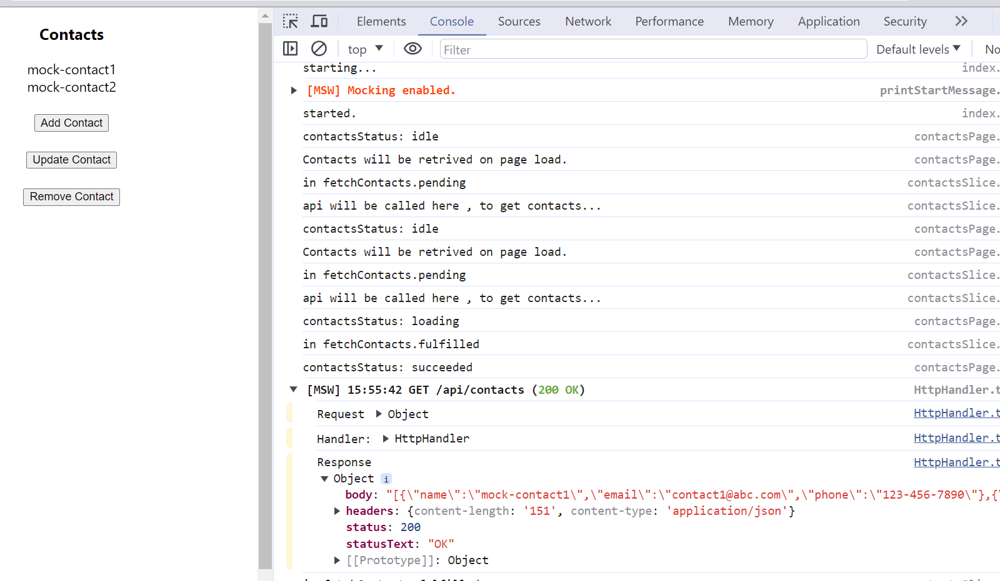

# Goal
Learning Mocking Service Worker to mock the APIs

## Details
* [Mock Service Worker (MSW)](https://mswjs.io/docs/) is an API mocking library for browser and Node.js. With MSW, you can intercept outgoing requests, observe them, and respond to them using mocked responses.

<details>
  <summary>learn minimum required to start our own mocking api server</summary>

* Go through introduction page [here](https://mswjs.io/docs/)
* Go through getting started page [here](https://mswjs.io/docs/getting-started)
* Go through only RESTAPI request handler [here](https://mswjs.io/docs/basics/intercepting-requests)
* Go through how to write mocking responses [here](https://mswjs.io/docs/basics/mocking-responses)
* Go through how to do RestAPI mock [here](https://mswjs.io/docs/network-behavior/rest)
* Check this out and don't need to go through the code but just interesting app
```cmd
    git clone https://github.com/kettanaito/movie-app.
    npm run dev
```
</details>

___

<details>
    <summary>using msw in react</summary>

* we will read this  [nice small tutorial](https://huntertrammell.dev/blog/how-to-quickly-create-a-mock-api-in-react-using-mock-service-worker) as it is simple to understand. But looks like some old article with some tweaks needed.
* we will use [this](https://kentcdodds.com/blog/replace-axios-with-a-simple-custom-fetch-wrapper)] as it has been used in the tutorial successfully.

</details>

___

<details>
  <summary>mocks</summary>

* handlers (api/handlers.js)
```js
    import { rest } from 'msw'

    export const handlers = [
    rest.get("/api/contacts", (req, res, ctx) => {
        return res(
        ctx.status(200),
        ctx.json({
            contacts: [
            {
                name: 'mock-contact1',
                email: 'contact1@abc.com',
                phone: '123-456-7890'
            },
            {
                name: 'mock-contact2',
                email: 'contact2@abc.com',
                phone: '999-888-1234'
            }
        ],
        })
        );
    }),
    ];
```
* api/browser.js (register handlers)
```js
    import { setupWorker } from "msw/browser";
    import { handlers } from "./handlers";
    // This configures a Service Worker with the given request handlers.
    export const worker = setupWorker(...handlers);
```
* api/client.js (copy from the sample)
* index.js
```js
    async function start() {

        console.log('starting...')
        await worker.start({ onUnhandledRequest: 'bypass' })
        console.log('started.')
        const root = ReactDOM.createRoot(document.getElementById("root"));
        root.render(
            <React.StrictMode>
            <Provider store={store}>
                <App />
            </Provider>
            </React.StrictMode>
        );
    }

    start();
```
</details>

___
<details>
    <summary>mockServiceWorker.js</summary>

the file _mockServiceWorker.js_ needs to be in public directory. Copied from node_modules\lib\msw directory
</details>

___
<details>
  <summary>ui</summary>


</details>


