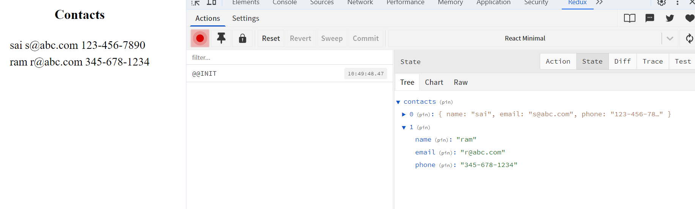

# Goal
Document high level of our understanding of Redux concepts in our own way

## Details
We will be extracting these concepts from [Redux tutorial](https://redux.js.org/tutorials/essentials/part-1-overview-concepts)

* [Redux dev tools](https://chromewebstore.google.com/detail/redux-devtools/lmhkpmbekcpmknklioeibfkpmmfibljd?hl=en) are essential to understand during the concepts 

* Redux
  * State manager
    * Every application needs data to be shared across all components
  * Using Patterns (Pattern is series of well followed steps )
    * Follow some rules
  * Library
  * Can be used outside React too but more familiar along with React.

____

## Concepts
Lets understand some basic concepts with our own simple project from scratch

<details>
  <summary>minimum react app</summary>

* Lets create minimum react app [steps](https://ymse.io/blog/how-to-create-a-minimal-react-app/)
  
  * creat empty package.json
  ```cmd
    md simple-app
    cd simple-app
    npm init -y
  ```
  * edit package.json
  ```json
    "type": "module",
    "source": "src/index.html",
    "scripts": {
      "dev": "parcel",
      "build": "parcel build"
    },
  ```
  * install dependencies
  ```cmd
     npm install parcel react react-dom 
  ``` 
  * create directories (specific to windows)
  ```cmd
    mkdir src
    mkdir src\components  
    type nul > src\index.html
    type nul > src\index.js
    type nul > src\components\App.jsx
  ```
  * Edit the file contents.
  * Run the app
    ```cmd
      npm run dev
    ```
  * Observe through React dev tools

  

</details>

___

<details>
   <summary>application</summary>

Every UI application has basic functionality like below

* component display part of the application data (view)
* allow the user to interact (add/update/delete) (modify)
* save the data to backend

</details>

___
<details>
   <summary>display contacts(view)</summary>

<details>
   <summary>slice (portion of the data)</summary>


Lets say we are displaying contacts which has following structure
```json
  [
    {
      name: 'sai',
      email: 's@abc.com',
      phone: '123-456-7890'
    },
    {
      name: 'ram',
      email: 'r@abc.com',
      phone: '345-678-1234'
    },
  ]
```

We want to display these in UI page in a table and want to use the _Redux_

* __slice__
  * slice is part of the data (think of pizza slice). Application may contain large amount of data , but one particular feature (managing contacts) is just one part(slice) of the applicaiton data. We will divide the in to _slice_ and interact with this in a component. This way the component which interacts with data  need not worry about the other data of applicaiton. The other data may be like profile data. users shoping cart, products etc.,

* lets design the slice
  * install redux toolkit
    ```cmd
      npm install @reduxjs/toolkit
    ```
  * create _features/contacts/contactsSlice.js_ file 
    * add initial state
      ```js
        // Initial state , hard coded here (in real application, comes from backend)
        const initialState =[
            {
              name: 'sai',
              email: 's@abc.com',
              phone: '123-456-7890'
            },
            {
              name: 'ram',
              email: 'r@abc.com',
              phone: '345-678-1234'
            },
          ]
      ```
   * import _redux toolkit_
     ```js
      import { createSlice } from '@reduxjs/toolkit'
     ```   
   * create contacts slice
     ```js
      const contactsSlice = createSlice({
          name: 'contacts',
          initialState,
      })      
     ```
   * export 
     ```js
      export default contactsSlice.reducer
     ```

   * we are done defining the _contacts_ information to be consumed later part. 

</details>

<details>
  <summary>store (which is centeral piece of redux ) </summary>

_store_ is the central coordinator for statement management.

  * creating store
    * create store.js in app/store.js
    * import redux
      ```js
        import { configureStore } from '@reduxjs/toolkit'
      ```
    * import contacts slice
      ```js
        import contactsReducer from './features/contacts/contactsSlice'
      ```
    * create store
      ```js
        export const store = configureStore({
            reducer: {
                contacts: contactsReducer
            },
        })        
      ```
    * at this time we have not defined _reducer_ which we will need when we want to update. At this time we are only getting to display. we will discuss _reducers_ when we need add/update/delete.
</details>

<details>
  <summary>accessing store to get contacts with useSelector</summary>

One cannot access store directly. The components need to access the data with __useSelector__ hook and __only relevant data__.

  * contactsPage.js
    * install _react redux_
      ```cmd
        npm install react-redux
      ```
    * import _useSelector_
    ```js
      import { useSelector } from 'react-redux';
    ```
    * get _contacts_ from _store_ using _selector_
    ```js
      const contacts = useSelector(state => state.contacts)
    ```
    * create simple rendering of contacts
    ```js
      const renderedContacts = contacts.map(contact => (
          <div>
              <td>{contact.name}</td>
              <td>{contact.email}</td>
              <td>{contact.phone}</td>
          </div>
      ));
    ```
    * return rendiner
    ```js
      return (
          <div align="center">
              <h3>Contacts</h3>
              <table>
                  {renderedContacts}
              </table>
          </div>
      )
    ```
</details>

<details>
  <summary>conneting store to the application</summary>

we need to connect the store to the application.
  * index.js
    * import redux provider an store
    ```js
    import { Provider } from 'react-redux'
    import { store } from './store'
    ```
    * wrap the _App_ with _Provider_
    ```js
      <Provider store={store}>
          <App />
      </Provider>
    ```
</details>

<details>
  <summary>run the app</summary>

  
  
</details>
</details>

___

  
## Learning

  <details>
    <summary>immutability</summary>

* Immutability
  * "Mutable" means changeable and "Immutable" means cannot be changed
  * Important in Redux world.
  * By default javascript objects/arrays is mutable
  * In order to make immutable (make a copy) by using spread operatiors,slices, concat (for arrays)
  * Redux helps in writing immutable code in cetain scenarios (read futher below.)

  </details>
  <details>
    <summary>parcel</summary>

    todo
  </details>