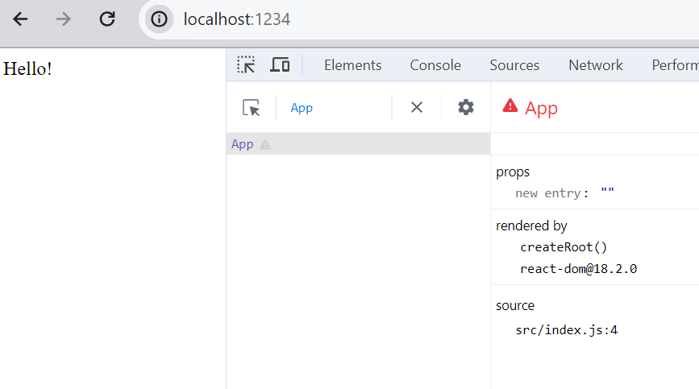

# Goal
Document high level of our understanding of Redux concepts in our own way

## Details
We will be extracting these concepts from [Redux tutorial](https://redux.js.org/tutorials/essentials/part-1-overview-concepts)

* [Redux dev tools](https://chromewebstore.google.com/detail/redux-devtools/lmhkpmbekcpmknklioeibfkpmmfibljd?hl=en) are essential to understand during the concepts 

* Redux
  * State manager
    * Every application needs data to be shared across all components
  * Using Patterns (Pattern is series of well followed steps )
    * Follow some rules
  * Library
  * Can be used outside React too but more familiar along with React.

____

## Concepts
Lets understand some basic concepts with our own simple project from scratch

<details>
  <summary>minimum react app</summary>

* Lets create minimum react app [steps](https://ymse.io/blog/how-to-create-a-minimal-react-app/)
  
  * creat empty package.json
  ```cmd
    md simple-app
    cd simple-app
    npm init -y
  ```
  * edit package.json
  ```json
    "type": "module",
    "source": "src/index.html",
    "scripts": {
      "dev": "parcel",
      "build": "parcel build"
    },
  ```
  * install dependencies
  ```cmd
     npm install parcel react react-dom 
  ``` 
  * create directories (specific to windows)
  ```cmd
    mkdir src
    mkdir src\components  
    type nul > src\index.html
    type nul > src\index.js
    type nul > src\components\App.jsx
  ```
  * Edit the file contents.
  * Run the app
    ```cmd
      npm run dev
    ```
  * Observe through React dev tools

  
  
</details>

_______

Immutability
  * "Mutable" means changeable and "Immutable" means cannot be changed
  * Important in Redux world.
  * By default javascript objects/arrays is mutable
  * In order to make immutable (make a copy) by using spread operatiors,slices, concat (for arrays)
  * Redux helps in writing immutable code in cetain scenarios (read futher below.)

  _____

  