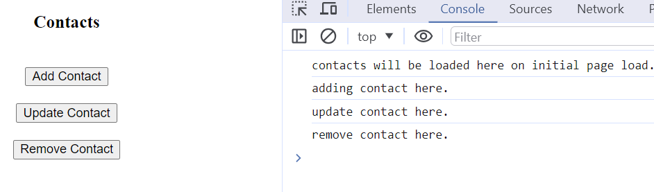
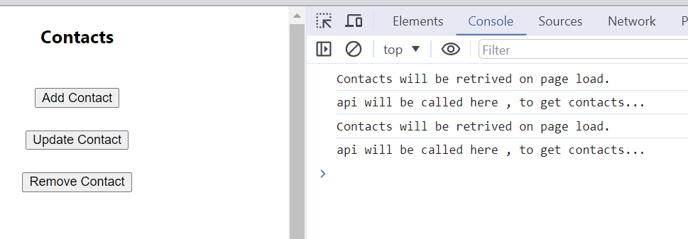

# Goal
Now that we have learned __thunk__ through previous tutorial, lets document main concepts through minimum react app.

## Details
* Make a copy of step4 which is just minimum react app.
* We will be doing everthing in Contact page as our goal is to add thunks.
  * we will not add separate list, add,update pages.
* We will not do any backend ,but observe the calls through developer tools to make sure that CRUD operations are sent to backend as expected.

* contacts state 
  * we will work with below state
  ```json
    [
      {
        name: "",
        email: "",
        phone: ""
      }
    ]
  ```

<details>
  <summary>initial setup</summary>

* install dependency
  ```cmd
    npm install react-redux
    npm install react-redux
  ```
* introduce basic contactsslice.js
  ```js
    import { createSlice } from '@reduxjs/toolkit';

    const initialState = {
        status: 'idle',
        contacts: [],
        error: null
    };

    const contactsSlice = createSlice({
        name: 'contacts',
        initialState,
        reducers: {}
    });

    export default contactsSlice.reducer    
  ```
* introduce store (store.js)
* update index.js to hook up store

</details>

___

<details>
  <summary>create contacts page with buttons</summary>

* We will have only 3 buttons as Listing of contacts will be done on loading page once.
* loadiang will be done using __useEffect__
  ```js
    useEffect(() => {
        console.log('contacts will be loaded here on initial page load.')
    }, [])

  ```


</details>

___

<details>
  <summary>adding contactsSlice</summary>

* add thunk
  ```js
    import { createSlice, createAsyncThunk } from '@reduxjs/toolkit';

    export const fetchContacts = createAsyncThunk('contacts/fetchContacts', async () => {
        console.log('api will be called here , to get contacts...')
        
        // return dummy data as if we got the data from api.
        return [
            {
                name:'contact1',
                email:'contact1@abc.com',
                phone:'123-456-7890'
            },
            {
                name:'contact2',
                email:'contact2@abc.com',
                phone:'999-888-1234'
            }
        ]
    });
  ```


</details>

___

<details>
  <summary>getting contacts on contacts page</summary>

* import fetchContacts
  ```js
    import { fetchContacts } from './contactsSlice'
  ```
* modify useEffect 
 ```js
      useEffect(() => {
        if (contactsStatus === 'idle') {
             console.log('Contacts will be retrived on page load.')
             dispatch(fetchContacts())
         }
    }, [contactsStatus, dispatch])
 ```
* you will see the fetchContacts being called in console log


__Note__: Thunk Being called twice , that is because the state is not changed from _idle_. we need to add reducer to change this.

</details>
___

# Learning
