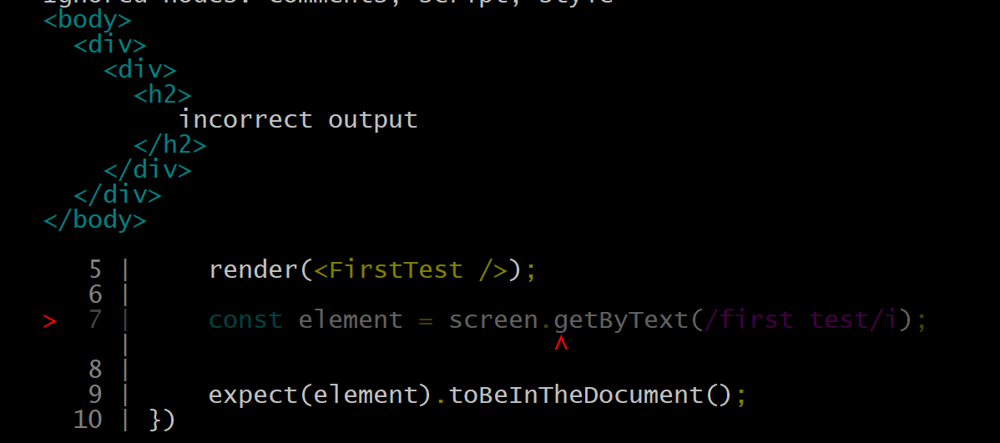
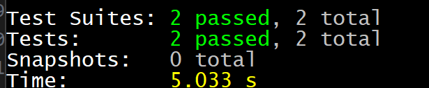

# Goal
Get basic introduction of unit test in React application.

## Details
we will follow this tutorial from [here](https://www.freecodecamp.org/news/how-to-write-unit-tests-in-react/).

### What to Test
In general, your tests should cover the following aspects of your code:

* If a component renders with or without props
* How a component renders with state changes
* How a component reacts to user interactions

### What Not to Test
Testing most of your code is important, but here are some things you do not need to test:

* Actual Implementation: You do not need to test the actual implementation of a functionality. Just test if the component is behaving correctly.
Let’s say you want to sort an array on the click of a button. There’s no need to test the actual sorting logic. You only test if the function was called and if the state changes are rendering correctly.
* Third Party libraries: If you are using any third party libraries like Material UI, no need to test those – they should already be tried and tested.

### Basic steps in test
* Render the component
* Get an element from the component and simulate any user interactions
* Write an assertion (assertion is making sure the expected behavior is)

___


<details>
  <summary>writing first test</summary>

* create react app
  ```cmd
    npx create-react-app app
  ```
* create FirstTest component in components/FirstTest.js
* create FirstTest.test.jsx in __test__ directory
* first make sure you are test fails ( this always good practice as some times false positive will happen in tests)
  ```js
    export const FirstTest = () => {
        return (
        <div>
            <h2> incorrect output </h2>
        </div>
        )
    }
    ```
* run test _npm test_
* test will fail
  
* fix the test
* run the test and make sure test succeeds
  

</details>

___

<details>
  <summary>1</summay>

</details>

___

<details>
  <summary>1</summay>

</details>

___


<details>
  <summary>1</summay>

</details>

___


<details>
  <summary>1</summay>

</details>

___

## Learning

<details>
   <summary>named vs default export</summary>

</details>